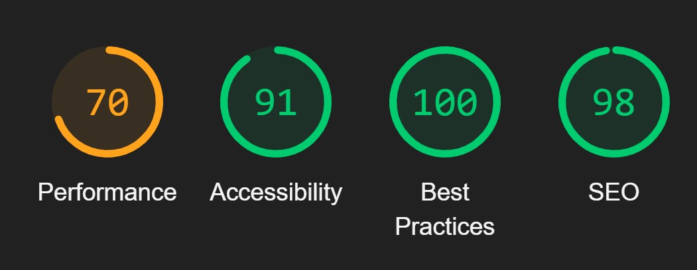

# Web Store 

Exploring React JS through a ecommerce site project!

## Status

### Deployment
[](https://app.netlify.com/sites/olivia-02-reactecomm/deploys)

### Lighthouse Stats


## Testing

1. Install the project dependencies
   ```shell
   npm install
   ```

2. Run the application
   ```shell
   npm run start
   ```
